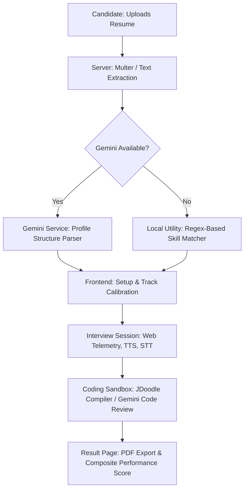

# 🤖 Camsense AI — AI Mock Interview & Proctoring Platform

An advanced, open-source mock interview platform that simulates real-world hiring rounds with AI-generated, resume-specific questions, live coding sandboxes, performance analytics, and anti-cheating telemetry.

Camsense AI acts as a stateless, high-fidelity assessment tool designed to help developers practice technical, behavioral, and coding interviews while providing admins with detailed compliance and performance tracking.

---

## 🌟 Key Features

- 📄 **Resume Profile Parsing**: Upload resumes (PDF or DOCX) to extract technical taxonomy, skills, education, and experience using Gemini AI, with a regex-based offline parser fallback.
- 🎙️ **Interactive AI Interviewer**: Live audio-based technical and behavioral questions utilizing Text-to-Speech (TTS) and Speech-to-Text (STT) transcription with dynamic AI-generated follow-up questions.
- 💻 **Algorithm Coding Sandbox**: Full coding workspace integrated with a Monaco Editor, supporting Javascript, Python, Java, and C++. Includes real-time compilation via JDoodle and AI-guided grading.
- 🛡️ **Anti-Cheating Proctoring & Telemetry**: Fullscreen enforcement and tab-switching monitoring. Violations trigger live warnings and apply automatic score penalties.
- 📊 **Detailed Assessment Reports**: Dynamic performance feedback scores, grading breakdown (syntax, scaling, communication, optimization), specific strengths and weaknesses lists, and a download-ready system PDF report.
- 🔄 **Offline Development Mode**: Seamless architectural fallbacks to local skill parsing regexes and local Ollama model routes (`llama3`) to enable offline testing without API charges.

---

## 🛠️ Technology Stack

### Frontend
- **Framework**: React.js with Vite
- **Styling**: Tailwind CSS & Vanilla CSS
- **Interactive Editor**: Monaco Editor (`@monaco-editor/react`)
- **PDF Generation**: `jspdf`
- **Icons**: `lucide-react`

### Backend
- **Framework**: Node.js & Express
- **File Uploads**: `multer`
- **Text Parsers**: `pdf-parse`, `mammoth` (for DOCX)
- **AI Integrations**: `@google/generative-ai` (Gemini 2.5 Flash), Ollama API (`llama3`)
- **Authentication**: Firebase Admin SDK (stateless session validation)

### Database (In Development)
- **Object Modeling**: Mongoose (MongoDB) / SQL (PostgreSQL schemas defined)

---

## ⚙️ Architecture & Data Flow



---

## 🚀 Getting Started

Follow these steps to set up and run the application locally.

### Prerequisites
- **Node.js**: Version 18.0 or higher is required.
- **Ollama** *(Optional)*: Installed locally for offline question generation.
- **Firebase Project**: Setup for email & password or Google sign-in.

### 1. Clone the Repository
```bash
git clone https://github.com/your-username/ai-interview-platform.git
cd ai-interview-platform
```

### 2. Configure Environment Variables
You need to create a `.env` file in the **root** folder and another in the **client** folder.

Safe starter templates are included:
```bash
cp .env.example .env
cp client/.env.example client/.env
```

`GEMINI_API_KEY`, Ollama, JDoodle, and Firebase Admin values are optional for local demo flows. Leave them blank when testing the stateless fallbacks, and provide real values only for integrations you actively use.

#### Root `.env` Setup
Create `.env` in the project root:
```env
PORT=5000
GEMINI_API_KEY=your_gemini_api_key_here
OLLAMA_API_URL=http://localhost:11434
JDOODLE_CLIENT_ID=your_jdoodle_client_id_here
JDOODLE_CLIENT_SECRET=your_jdoodle_client_secret_here
```

#### Client `.env` Setup
Create `client/.env`:
```env
VITE_FIREBASE_API_KEY=your_firebase_api_key_here
VITE_FIREBASE_AUTH_DOMAIN=your_firebase_auth_domain_here
VITE_FIREBASE_PROJECT_ID=your_firebase_project_id_here
VITE_FIREBASE_STORAGE_BUCKET=your_firebase_storage_bucket_here
VITE_FIREBASE_MESSAGING_SENDER_ID=your_firebase_messaging_sender_id_here
VITE_FIREBASE_APP_ID=your_firebase_app_id_here
VITE_FIREBASE_MEASUREMENT_ID=your_firebase_measurement_id_here
```

### 3. Install Dependencies
Run npm installs for the workspace:
```bash
# Install root backend dependencies
npm install

# Install client frontend dependencies
cd client
npm install
cd ..
```

### 4. Run the Application
Start the backend and frontend servers in separate terminals:

**Terminal 1 (Backend API):**
```bash
npm run server
```
*Starts Express on [http://localhost:5000](http://localhost:5000)*

**Terminal 2 (Frontend Client):**
```bash
npm run client
```
*Starts Vite on [http://localhost:3000](http://localhost:3000) (Proxies `/api` requests to port 5000)*

---

## 🔄 Offline Development & Testing Fallbacks

To ensure smooth testing without consuming Gemini or JDoodle API quotas:
1. **Ollama Integration**: If the `GEMINI_API_KEY` is not present, or if Ollama is running locally, you can choose to query a local `llama3` model for parsing. If both are unreachable, the server falls back to high-quality pre-seeded technical question pools based on target roles.
2. **Local Resume Extraction**: Uses a local regex-based keyword parser in `server/utils/parsers/resumeParser.js` to identify skills if LLMs fail or are disconnected.
3. **Simulation Compiler**: If JDoodle API credentials are not found in the env variables, the coding sandbox runs simulated executions utilizing LLM heuristics.

---

## 🧼 Repository Hygiene & Validation

We maintain strict clean branch practices. Automated workflows validate that no temporary back-ups (like `old_controller`), un-ignored build artifacts, or client resume uploads (.pdf) are checked into source control. Always verify files with `git status` before committing.

---

## 📝 License

This project is licensed under the MIT License - see the [LICENSE](LICENSE) file for details.
